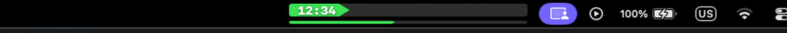

# Progress Clock

A minimal macOS menu bar app that shows your day as a live progress bar — so you always know where you are in your day at a glance.



---

## What it does

Progress Clock lives in your menu bar and draws **two progress bars**:

| Bar | What it shows |
|-----|---------------|
| **Day bar** (tall) | How far through your waking day you are, with the current time |
| **Activity bar** (thin stripe) | Progress within your current time block (work, free, morning, etc.) |

Colors tell you what you're in right now:

- 🟡 **Yellow** — unscheduled time (morning, afternoon, evening)
- 🟢 **Green** — work hours
- 🔵 **Blue** — free time
- 🔴 **Red** — sleep / night

Each bar can independently run **forward or backward**, and fill from the **left or right** — so you can set it up exactly how your brain wants to see time.

---

## Requirements

- macOS 12 (Monterey) or later
- Xcode Command Line Tools (for building from source)

---

## Install

### 1. Clone the repo

```bash
git clone https://github.com/skakunm/progress_clock.git
cd progress_clock
```

### 2. Build

```bash
./build.sh
```

This compiles the app into `build/ProgressClock.app`.

### 3. Run immediately (no install)

```bash
open build/ProgressClock.app
```

### 4. Install to /Applications (optional)

```bash
./install.sh
```

Then launch it with:

```bash
open /Applications/ProgressClock.app
```

---

## Launch at login

1. Open **System Settings → General → Login Items**
2. Click **+** and add `ProgressClock.app`

---

## Configuration

Click the progress bar in your menu bar to open the menu. Everything is configurable from there — no config files to edit.

### What you can change

**Day**
- Wake time and sleep time (the full span of your day)
- Direction: bar fills left→right or right→left
- Fill anchor: bar grows from left or right

**Work block**
- Start and end time
- Enable / disable
- Direction and fill anchor (independent from the day bar)

**Free block**
- Start and end time
- Enable / disable
- Direction and fill anchor

**Sleep**
- Direction and fill anchor for the overnight bar

### Editing times

Click any section in the menu → **Edit times…** and type in `HH:MM` format. Sleep time past midnight works fine (e.g. `01:00`).

---

## How the bars work

```
Wake ──────────────────────────────────────── Sleep
      [morning][  work  ][afternoon][free][evening]

Day bar:      ████████████▶                     59% of waking day
Activity bar: ████▶                             41% through "work"
```

During sleep, both bars show the night in red — counting toward wake time.

---

## Project structure

```
progress_clock/
├── src/
│   └── main.swift      # entire app — ~500 lines, no dependencies
├── Info.plist           # app bundle metadata
├── build.sh             # compiles with swiftc → build/ProgressClock.app
└── install.sh           # copies built app to /Applications
```

No Xcode project, no Swift Package Manager, no dependencies. Just `swiftc` and AppKit.

---

## Building manually (optional)

```bash
swiftc -swift-version 5 -framework AppKit -framework Foundation \
  -O -o build/ProgressClock.app/Contents/MacOS/ProgressClock \
  src/main.swift
```

---

## License

MIT — do whatever you want with it.
