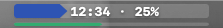
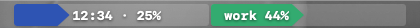
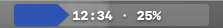

# Progress Clock

A minimal macOS menu bar app that shows your day as a live progress bar — so you always know where you are at a glance.

**Stacked** (default) — day bar + thin activity stripe below it:


**Side by side** — day and activity bars next to each other:


**Single** — one bar, swap between day and activity with "Swap bars":


---

## What it shows

| Bar | What it tracks |
|-----|----------------|
| **Day bar** (indigo) | How far through your waking day you are |
| **Activity bar** (colored) | Progress within your current time block |

Colors tell you what block you're in:

- 🟠 **Amber** — unscheduled time (morning, afternoon, evening)
- 🟢 **Emerald** — work hours
- 🟣 **Amethyst** — free time
- 🔴 **Crimson** — sleep / night

Each bar can independently run **forward or backward** and fill from the **left or right**.

Hover over the bar to see the current time and percentages. Click to open the menu.

---

## Requirements

- macOS 12 (Monterey) or later
- Xcode Command Line Tools (for building from source)

---

## Install

### Option A — Homebrew (recommended)

```bash
brew tap skakunm/progress_clock https://github.com/skakunm/progress_clock
brew trust skakunm/progress_clock
brew install --cask progress-clock
```

Homebrew handles the download and installation. If macOS shows a Gatekeeper prompt, run this once after installing:

```bash
xattr -d com.apple.quarantine /Applications/ProgressClock.app
```

### Option B — Build from source

```bash
git clone https://github.com/skakunm/progress_clock.git
cd progress_clock
./build.sh
```

#### Run immediately (no install)

```bash
open build/ProgressClock.app
```

#### Install to /Applications (optional)

```bash
./install.sh
```

---

## Uninstall

**Homebrew:**
```bash
brew uninstall --cask progress-clock
```

**Manual:**
```bash
pkill -x ProgressClock
sudo rm -rf /Applications/ProgressClock.app
# Then remove from System Settings → General → Login Items
```

---

## Configuration

Click the bar in the menu bar to open the menu. Everything is configured there — no files to edit.

### Layout

| Mode | Description |
|------|-------------|
| **Stacked** | Day bar (tall) on top, activity bar (thin stripe) below — default |
| **Side by side** | Two equal-height bars next to each other (double width) |
| **Single** | One bar — use **Swap bars** to switch between day and activity |

**Swap bars** — reverses which bar is primary in every layout mode.

### Show

What label is drawn inside the bar(s):

| Option | What you see |
|--------|--------------|
| **None** | No label — bars only |
| **Time** | Current time (`12:34`) |
| **Percentage** | Progress percentage (`56%`) |
| **Both** | Time and percentage (`12:34 · 56%`) — M width and above only |

### Width

Five levels: **XS · S · M · L · XL** — default is **M**. At XS/S, "Both" is disabled.

### Per-interval settings (Day / Work / Free / Sleep)

- **Direction** — bar fills forward (→) or backward (←)
- **Fill anchor** — bar grows from the left or the right
- **Enable / disable** — Work and Free blocks can be toggled off
- **Edit times…** — type start/end times in `HH:MM`; sleep past midnight works (e.g. `01:00`)

---

## How the bars work

```
Wake ──────────────────────────────────────── Sleep
      [morning][  work  ][afternoon][free][evening]

Day bar:      ████████████▶                     56% of waking day
Activity bar: █████████████████▶                71% through "work"
```

During sleep both bars run in red, counting toward wake time.

---

## Project structure

```
progress_clock/
├── src/
│   └── main.swift      # entire app — ~700 lines, no dependencies
├── Info.plist           # app bundle metadata
├── build.sh             # compiles with swiftc → build/ProgressClock.app
├── install.sh           # copies built app to /Applications
└── Casks/
    └── progress-clock.rb  # Homebrew cask
```

No Xcode project, no Swift Package Manager, no dependencies. Just `swiftc` and AppKit.

---

## License

MIT — do whatever you want with it.
